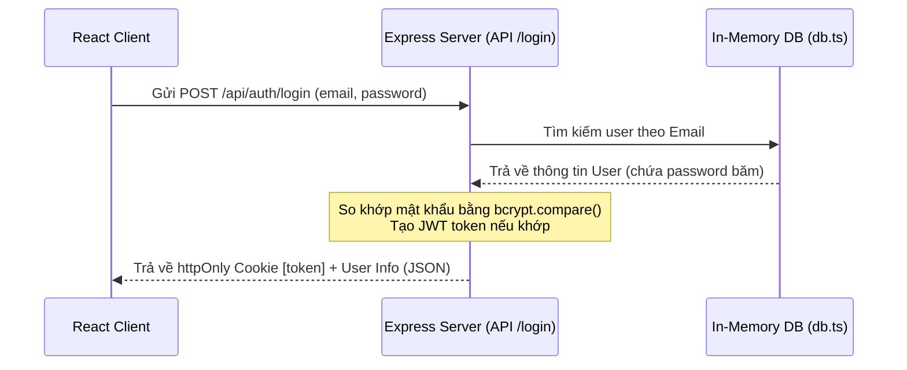
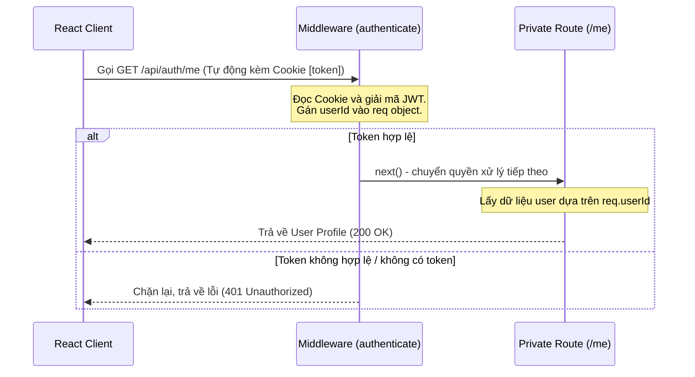

# Tài Liệu Hướng Dẫn Luồng Hoạt Động Hệ Thống Authentication (Backend)

Tài liệu này giải thích chi tiết cấu trúc thư mục, ý nghĩa mã nguồn và luồng đi của dữ liệu (Data Flow) trong hệ thống xác thực người dùng (Authentication) của Backend, sử dụng Express.js (với Bun runtime), TypeScript, JWT (JSON Web Tokens), Cookies và BcryptJS.

---

## 1. Cấu Trúc Thư Mục Backend

```text
backend/
├── src/
│   ├── index.ts              # File khởi chạy ứng dụng (Entry Point)
│   ├── db.ts                 # Mô phỏng Cơ sở dữ liệu (In-memory DB)
│   ├── types/
│   │   └── express.d.ts      # Mở rộng kiểu dữ liệu Request của Express
│   ├── middleware/
│   │   └── auth.ts           # Middleware kiểm tra quyền truy cập (Authentication Middleware)
│   └── routes/
│       └── auth.ts           # Định nghĩa các API Routes liên quan đến Auth
├── package.json              # Khai báo thư viện phụ thuộc và scripts chạy dự án
└── tsconfig.json             # Cấu hình compiler TypeScript
```

---

## 2. Giải Thích Ý Nghĩa Từng File và Thành Phần

### A. Mô phỏng Database (`src/db.ts`)
*   **Ý nghĩa:** Vì dự án ở mức độ luyện tập nên chưa kết nối cơ sở dữ liệu thật (MongoDB, PostgreSQL, v.v.). File này tạo ra một mảng `users` lưu trong RAM (in-memory) để lưu trữ thông tin người dùng tạm thời khi đăng ký.
*   **Chi tiết thành phần:**
    *   `interface User`: Định nghĩa cấu trúc dữ liệu của một User gồm `id` (number), `email` (string), `password` (string - đã mã hóa), và `name` (string).
    *   `users`: Mảng chứa các đối tượng User. Dữ liệu sẽ mất khi server restart.
    *   `getNextId()`: Hàm tự động tăng giá trị `id` khi có user mới đăng ký (giống cơ chế Auto-increment).

### B. Cấu hình Kiểu Dữ Liệu (`src/types/express.d.ts`)
*   **Ý nghĩa:** Mặc định đối tượng `Request` của Express không có thuộc tính `userId` và `userEmail`.
*   **Giải pháp:** Sử dụng tính năng "Declaration Merging" của TypeScript để khai báo thêm 2 trường tùy chọn (`userId?` và `userEmail?`) vào interface `Request` của Express toàn cục. Điều này giúp chúng ta lưu trữ thông tin của user đã login trực tiếp vào object `req` trong lúc đi qua Middleware để các Route tiếp theo sử dụng được mà không bị lỗi biên dịch TypeScript.

### C. Middleware Xác Thực (`src/middleware/auth.ts`)
*   **Ý nghĩa:** Đóng vai trò là "người gác cổng". Bảo vệ các API Private (như lấy thông tin cá nhân `/me` hoặc check trạng thái `/check`), chỉ cho phép các request đã đăng nhập thành công đi qua.
*   **Luồng hoạt động:**
    1.  Lấy JWT token từ cookie của client gửi lên qua `req.cookies.token` (sử dụng thư viện `cookie-parser` hỗ trợ đọc).
    2.  Nếu **không có token**: Trả về mã lỗi `401 Unauthorized` ngay lập tức.
    3.  Nếu **có token**: Sử dụng hàm `jwt.verify()` kết hợp với khóa bí mật `process.env.JWT_SECRET` để giải mã token.
    4.  Nếu token hợp lệ và chưa hết hạn: Giải nén thông tin payload (chứa `userId` và `email`), gán chúng vào `req.userId` và `req.userEmail`, sau đó gọi hàm `next()` để tiếp tục chuyển giao request cho API handler tiếp theo xử lý.
    5.  Nếu token không hợp lệ (sai mã, đã bị chỉnh sửa hoặc hết hạn): Khối `catch(err)` hoạt động và trả về mã lỗi `401 Invalid or expired token`.

### D. Các Auth API Routes (`src/routes/auth.ts`)
Đây là nơi chứa toàn bộ logic nghiệp vụ của các API xác thực:

#### 1. Đăng ký tài khoản (`POST /api/auth/register`)
*   **Luồng xử lý:**
    1.  Nhận `email`, `password`, `name` từ client (`req.body`).
    2.  **Validate dữ liệu đầu vào:** Kiểm tra xem các trường có trống không? Email có chứa ký tự `@` hợp lệ không? Độ dài mật khẩu tối thiểu có đủ 6 ký tự không? Nếu sai, trả về lỗi `400 Bad Request`.
    3.  **Kiểm tra trùng lặp:** Dùng `users.find()` tìm xem email đã tồn tại trong mảng `users` chưa. Nếu rồi, báo lỗi `400 Email already registered`.
    4.  **Mã hóa mật khẩu:** Sử dụng `bcrypt.hash()` với salt round là `10` để băm mật khẩu gốc thành một chuỗi bảo mật ngẫu nhiên không thể giải ngược.
    5.  **Lưu trữ:** Tạo user mới với mật khẩu đã mã hóa, đẩy vào mảng `users`.
    6.  Trả về mã thành công `201 Created`.

#### 2. Đăng nhập (`POST /api/auth/login`)
*   **Luồng xử lý:**
    1.  Nhận `email`, `password` từ client.
    2.  Tìm user theo `email` trong mảng `users`. Nếu không tìm thấy, trả về `401 Invalid user`.
    3.  **So khớp mật khẩu:** Sử dụng `await bcrypt.compare(password, user.password)` để kiểm tra mật khẩu người dùng nhập có khớp với mật khẩu đã băm lưu trong DB hay không. Nếu không khớp, trả về `401 Invalid password`.
    4.  **Tạo JWT token:** Tạo chữ ký JWT bằng `jwt.sign()` với payload chứa `userId` và `email`, cấu hình thời hạn hết hạn từ biến môi trường.
    5.  **Thiết lập Cookie:** Đính kèm token vào Response cookie tên là `token` với các cờ bảo mật:
        *   `httpOnly: true` ngăn chặn JavaScript phía Client (như các mã độc XSS) truy cập vào token.
        *   `secure: true/false` yêu cầu truyền tải qua HTTPS (ở môi trường phát triển local có thể để `false`).
        *   `sameSite: 'lax'` bảo vệ chống lại tấn công CSRF (Cross-Site Request Forgery).
        *   `maxAge` đặt hạn sử dụng cho cookie (ở đây là 24 giờ).
    6.  Trả về thông tin User (không kèm mật khẩu) và lời nhắn đăng nhập thành công.

#### 3. Đăng xuất (`POST /api/auth/logout`)
*   **Luồng xử lý:**
    1.  Gọi `res.clearCookie('token')` để xóa cookie `token` khỏi trình duyệt của người dùng.
    2.  Trả về phản hồi thông báo đăng xuất thành công.

#### 5. Lấy thông tin cá nhân (`GET /api/auth/me`)
*   **Luồng xử lý:**
    1.  API này sử dụng middleware `authenticate`. Do đó, khi đi vào hàm này, request chắc chắn đã có sẵn `req.userId`.
    2.  Tìm kiếm người dùng trong mảng `users` có ID trùng với `req.userId`.
    3.  Nếu không thấy (trường hợp hiếm khi tài khoản bị xóa khi đang đăng nhập), trả về `404 user not found`.
    4.  Nếu tìm thấy, trả về các trường thông tin cơ bản: `id`, `email`, `name`.

#### 6. Kiểm tra trạng thái đăng nhập (`GET /api/auth/check`)
*   **Luồng xử lý:**
    1.  Sử dụng middleware `authenticate` để kiểm tra token.
    2.  Nếu token hợp lệ, nó sẽ trả về thông tin `isAuthenticated: true` và `userId` để giúp Frontend nhanh chóng xác thực xem route này có được truy cập hay không.

### E. File Entry Point của Server (`src/index.ts`)
*   **Ý nghĩa:** Cấu hình và khởi chạy ứng dụng Express.
*   **Chi tiết thành phần:**
    *   Cấu hình biến môi trường (`dotenv.config()`).
    *   Cài đặt **CORS (Cross-Origin Resource Sharing)**: Cho phép Frontend chạy từ port `5173` (thường là Vite/React) có quyền gọi API đến Backend port `5000` và đính kèm thông tin bảo mật (cookie) qua thuộc tính `credentials: true`.
    *   `cookieParser()`: Phân tích các cookie được gửi kèm theo request và đưa chúng vào đối tượng `req.cookies`.
    *   `express.json()`: Cho phép Express đọc và phân tích dữ liệu dạng JSON được gửi lên từ thân request (`req.body`).
    *   Đăng ký router `/api/auth` dẫn đến file chứa các route xác thực.
    *   Khởi chạy server lắng nghe trên cổng `5000`.

---

## 3. Biểu Đồ Luồng Hoạt Động (Data Flow) của Quá Trình Auth

### Luồng Đăng nhập (Login Flow)


### Luồng Gọi API Cần Xác Thực (Protected Request Flow)

