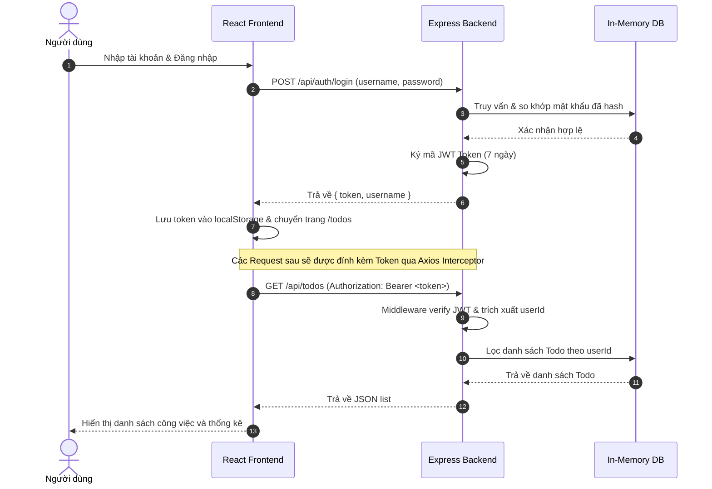

# Tổng hợp Kiến thức và Hướng dẫn Thực hiện Chi tiết Dự án Todo App (JWT + React + Express)

Tài liệu này tổng hợp toàn bộ kiến thức cốt lõi, cấu trúc dự án và hướng dẫn từng bước chi tiết để xây dựng ứng dụng Fullstack Todo App với cơ chế xác thực JWT (JSON Web Tokens), sử dụng **Bun runtime**, **Express (Backend)** và **React + TypeScript + Vite (Frontend)**.

---

## 1. Tổng quan Kiến thức Cốt lõi

### 1.1. Xác thực bằng JSON Web Token (JWT)
JWT là một phương thức xác thực không trạng thái (stateless). Thay vì lưu trữ session của người dùng trên server, thông tin người dùng được mã hóa thành một chuỗi token gửi về client. Client sẽ lưu trữ token này (ở đây dùng `localStorage`) và gửi đính kèm vào mỗi HTTP Request tiếp theo để xác thực.

*   **Cấu trúc JWT**: Gồm 3 phần phân tách bằng dấu chấm `.`:
    *   **Header**: Chứa thuật toán mã hóa (ví dụ: HS256) và loại token (JWT).
    *   **Payload**: Chứa thông tin người dùng (userId, username) và thời gian hết hạn (`expiresIn`). Không nên lưu thông tin nhạy cảm như mật khẩu ở đây.
    *   **Signature**: Chữ ký dùng để xác thực tính toàn vẹn của token, được tạo bằng cách mã hóa Header + Payload kết hợp với một khóa bí mật (`JWT_SECRET`) lưu trên Server.
*   **Authorization Header**: Phía client gửi token lên server qua HTTP Header:
    ```http
    Authorization: Bearer <your_jwt_token>
    ```

### 1.2. Cơ sở dữ liệu In-Memory (Bộ nhớ tạm)
Để tối giản hóa dự án, dữ liệu được lưu trữ trực tiếp trong bộ nhớ RAM bằng cấu trúc dữ liệu `Map` của JavaScript thay vì cơ sở dữ liệu vật lý (như MongoDB hay MySQL).
*   **Đặc điểm**: Tốc độ đọc/ghi siêu nhanh, truy vấn tìm kiếm theo khóa (ID) hiệu quả với độ phức tạp $O(1)$.
*   **Hạn chế**: Dữ liệu sẽ bị mất hoàn toàn mỗi khi Server khởi động lại (restart).

### 1.3. Axios Interceptor (Bộ chặn yêu cầu)
Axios cho phép định nghĩa các interceptor để can thiệp vào tiến trình gửi request hoặc nhận response. Trong dự án này, một request interceptor được cấu hình để tự động lấy JWT từ `localStorage` và đính vào header `Authorization` của mọi request gửi đi, giúp giảm thiểu việc viết code lặp lại.

### 1.4. Vite Reverse Proxy (Chuyển tiếp cổng)
Trong môi trường phát triển (development), Frontend chạy trên cổng `5173` và Backend chạy trên cổng `5000`. Để tránh lỗi phân chia nguồn tài nguyên (CORS) và đơn giản hóa URL API, cấu hình proxy trong `vite.config.ts` sẽ chuyển hướng toàn bộ request bắt đầu bằng `/api` từ cổng `5173` sang cổng `5000` của Backend.

---

## 2. Cấu trúc Dự án (Project Structure)

Dự án được chia thành 2 thư mục độc lập điều hành bởi **Bun**:

```text
todo-app-jwt/
├── backend/
│   ├── src/
│   │   ├── middleware/
│   │   │   └── authMiddleware.ts  # Middleware kiểm tra và giải mã JWT
│   │   ├── routes/
│   │   │   ├── authRoutes.ts      # API Đăng ký, Đăng nhập
│   │   │   └── todoRoutes.ts      # API CRUD danh sách Todo
│   │   ├── db.ts                  # Cơ sở dữ liệu in-memory (Map)
│   │   ├── index.ts               # Entrypoint khởi tạo Express Server
│   │   └── types.ts               # Định nghĩa kiểu dữ liệu TypeScript
│   ├── .env                       # File cấu hình biến môi trường (PORT, JWT_SECRET)
│   ├── package.json               # Quản lý dependencies của backend
│   └── tsconfig.json              # Cấu hình TypeScript Compiler
│
├── frontend/
│   ├── src/
│   │   ├── api/
│   │   │   └── axiosClient.ts     # Axios instance đính kèm JWT interceptor
│   │   ├── pages/
│   │   │   ├── Login.tsx          # Giao diện Đăng nhập
│   │   │   ├── Register.tsx       # Giao diện Đăng ký
│   │   │   └── Todos.tsx          # Giao diện quản lý Todo (Bảng điều khiển)
│   │   ├── App.css                # Style CSS chính (Glassmorphism & Neon)
│   │   ├── App.tsx                # Định tuyến (Routing) và PrivateRoute
│   │   ├── index.css              # Reset & style toàn cục
│   │   └── main.tsx               # Entrypoint React
│   ├── index.html                 # File HTML chính
│   ├── vite.config.ts             # Cấu hình Vite & API Proxy
│   └── package.json               # Quản lý dependencies của frontend
└── summary.md                     # File tổng hợp kiến thức (file này)
```

---

## 3. Quy trình Thực hiện Chi tiết Từng bước

### Bước 1: Khởi tạo và thiết lập dự án

1.  **Cài đặt và khởi tạo thư mục Backend**:
    *   Tạo thư mục `backend`, chạy lệnh khởi tạo dự án Bun:
        ```bash
        bun init -y
        ```
    *   Cài đặt các gói phụ thuộc cần thiết:
        ```bash
        bun add express cors dotenv jsonwebtoken bcryptjs
        bun add --dev @types/express @types/cors @types/jsonwebtoken @types/bcryptjs @types/node typescript
        ```
2.  **Khởi tạo thư mục Frontend**:
    *   Dùng Vite để tạo ứng dụng React với TypeScript:
        ```bash
        bun create vite frontend --template react-ts
        ```
    *   Di chuyển vào thư mục frontend và cài đặt dependencies:
        ```bash
        cd frontend
        bun install
        bun add axios react-router-dom
        ```

---

### Bước 2: Phát triển Backend (Phần máy chủ)

#### 2.1. Định nghĩa kiểu dữ liệu (`backend/src/types.ts`)
Định nghĩa cấu trúc dữ liệu cho `User` và `Todo` để tận dụng kiểm tra lỗi tĩnh của TypeScript.
*   `User`: gồm `id`, `username`, và `passwordHash` (mật khẩu đã mã hóa).
*   `Todo`: gồm `id`, `userId` (để liên kết với người dùng tạo ra nó), `text`, `completed` (trạng thái), và `priority` (`low` | `medium` | `high`).

#### 2.2. Thiết lập Database ảo (`backend/src/db.ts`)
Sử dụng cấu trúc `Map` trong JavaScript để làm nơi lưu trữ dữ liệu tập trung:
```typescript
import type { User, Todo } from './types';
export const users = new Map<string, User>();
export const todos = new Map<string, Todo>();
```

#### 2.3. Viết Middleware xác thực JWT (`backend/src/middleware/authMiddleware.ts`)
*   Lấy dữ liệu từ HTTP Header `Authorization`.
*   Tách chuỗi để lấy JWT Token (loại bỏ tiền tố `Bearer `).
*   Sử dụng thư viện `jsonwebtoken` để verify chữ ký dựa trên khóa `JWT_SECRET`.
*   Nếu hợp lệ, gán payload giải mã được (chứa `userId` và `username`) vào thuộc tính `req.user` của đối tượng request rồi gọi `next()` để tiếp tục route. Nếu không hợp lệ, trả về status `401` hoặc `403`.

#### 2.4. Viết API xác thực (`backend/src/routes/authRoutes.ts`)
*   **`POST /register`**:
    *   Nhận `username` và `password`.
    *   Kiểm tra trùng lặp tài khoản trong `users` Map.
    *   Mã hóa mật khẩu bằng `bcryptjs` với độ muối (salt) là 10.
    *   Tạo ID ngẫu nhiên bằng `crypto.randomUUID()`.
    *   Lưu thông tin tài khoản mới vào `users` Map.
*   **`POST /login`**:
    *   Nhận thông tin đăng nhập.
    *   Kiểm tra xem username có tồn tại không.
    *   So sánh mật khẩu nhập vào với mật khẩu đã mã hóa bằng `bcrypt.compare`.
    *   Nếu khớp, ký một chuỗi JWT bằng `jwt.sign()` với khóa bí mật và thiết lập thời hạn sống là 7 ngày (`{ expiresIn: '7d' }`).
    *   Trả về token cùng tên người dùng.

#### 2.5. Viết API quản lý công việc (`backend/src/routes/todoRoutes.ts`)
Các route này đều được áp dụng middleware `authenticateToken` để bảo vệ:
*   **`GET /`**: Lọc và trả về danh sách công việc của người dùng hiện tại thông qua `userId` được trích xuất từ `req.user`.
*   **`POST /`**: Nhận `text` và `priority`, khởi tạo một Todo mới, gán `userId` bằng ID của user đang đăng nhập, lưu vào `todos` Map.
*   **`PUT /:id`**: Tìm kiếm Todo trong Map theo ID nhận từ URL. Kiểm tra quyền sở hữu (`todo.userId === req.user.userId`). Nếu đúng, tiến hành cập nhật trạng thái `completed`, nội dung hoặc mức độ ưu tiên.
*   **`DELETE /:id`**: Kiểm tra quyền sở hữu và tiến hành xóa Todo khỏi Map.

#### 2.6. Khởi chạy Server chính (`backend/src/index.ts`)
*   Đọc tệp tin môi trường `.env` thông qua `dotenv`.
*   Cấu hình Express trung gian (Middleware): `cors()` hỗ trợ chia sẻ nguồn tài nguyên và `express.json()` phân tích cú pháp JSON trong request body.
*   Đăng ký các tiền tố route: `/api/auth` trỏ tới `authRoutes` và `/api/todos` trỏ tới `todoRoutes`.
*   Lắng nghe các kết nối trên cổng cấu hình (mặc định là `5000`).

---

### Bước 3: Phát triển Frontend (Phần giao diện)

#### 3.1. Cấu hình Axios Client (`frontend/src/api/axiosClient.ts`)
Khởi tạo instance axios với `baseURL: '/api'`. Cài đặt Request Interceptor để tự động kiểm tra xem tệp lưu trữ cục bộ (`localStorage`) có lưu chuỗi `token` không. Nếu có, đính chuỗi này vào thuộc tính `headers.Authorization` dưới định dạng `Bearer <token>`.

#### 3.2. Cấu hình Vite Proxy (`frontend/vite.config.ts`)
Trong file cấu hình, định nghĩa bộ lọc proxy:
```typescript
server: {
  proxy: {
    '/api': {
      target: 'http://localhost:5000',
      changeOrigin: true,
    }
  }
}
```
Mọi request gửi tới `/api/...` từ phía React sẽ được Vite chuyển tiếp ngầm đến cổng `5000` mà không làm xuất hiện lỗi CORS ở trình duyệt.

#### 3.3. Xây dựng Routing và Hợp phần bảo vệ (`frontend/src/App.tsx`)
*   Sử dụng thư viện `react-router-dom` để thiết lập 3 trang chính: `/login`, `/register`, `/todos`.
*   Viết hợp phần **`PrivateRoute`**: Kiểm tra sự tồn tại của `token` trong `localStorage`. Nếu không có, thực hiện chuyển hướng (`Navigate`) người dùng về trang đăng nhập `/login`, chặn không cho phép xem trang danh sách việc cần làm.

#### 3.4. Xây dựng trang Đăng nhập & Đăng ký (`Login.tsx`, `Register.tsx`)
*   Sử dụng các component form để nhận và kiểm tra thông tin nhập vào từ người dùng thông qua React state (`useState`).
*   Thực hiện gửi thông tin tài khoản qua Axios.
*   Tại trang đăng nhập, khi có phản hồi thành công, lưu lại `token` và `username` vào `localStorage`, sau đó điều hướng người dùng tới trang `/todos`.

#### 3.5. Xây dựng trang Todo chính (`frontend/src/pages/Todos.tsx`)
*   **Trạng thái**: Quản lý danh sách các công việc (`todos`), giá trị nhập mới cho task (`newText`), độ ưu tiên chọn lựa (`newPriority`).
*   **Dữ liệu**: Gọi API `GET /todos` ngay khi trang được tải (`useEffect`). Nếu API trả về mã lỗi `401` hoặc `403` (token hết hạn/không hợp lệ), tự động dọn sạch `localStorage` và chuyển hướng về trang `/login`.
*   **Các tính năng tương tác**:
    *   *Thêm công việc*: Nhập tên công việc, chọn độ ưu tiên (Low, Medium, High) -> Gửi request `POST /todos` -> Cập nhật danh sách hiển thị.
    *   *Đổi trạng thái*: Click checkbox để đổi trạng thái hoàn thành -> Gửi request `PUT /todos/:id` cập nhật `completed` -> Cập nhật lại giao diện.
    *   *Chỉnh sửa (Edit Modal)*: Khi double click vào nội dung công việc hoặc click nút bút chì ✏️, một popup modal hiện lên cho phép cập nhật tên và mức độ ưu tiên công việc. Nhấn lưu sẽ gửi request `PUT /todos/:id` cập nhật dữ liệu.
    *   *Xóa*: Click biểu tượng thùng rác 🗑️ gửi request `DELETE /todos/:id` để gỡ bỏ công việc.
    *   *Thống kê nhanh*: Hiển thị tổng số công việc, số việc đang chờ xử lý, số việc đã hoàn thành qua các thẻ thống kê trực quan.

#### 3.6. Thiết kế giao diện đẹp mắt (`frontend/src/App.css`)
Ứng dụng sử dụng một giao diện tối (Dark Mode) hiện đại với các yếu tố trực quan cao:
*   **Glassmorphism**: Các khối nội dung lớn có thuộc tính `backdrop-filter: blur(20px)` và nền hơi trong suốt tạo chiều sâu.
*   **Glow Effects**: Sử dụng các dải màu chuyển động `radial-gradient` ở nền trang và hiệu ứng đổ bóng phát sáng (`box-shadow` neon) cho các nút và thẻ đang hoạt động.
*   **Phân loại màu sắc theo độ ưu tiên**:
    *   🔴 **High**: Viền và nhãn màu đỏ tươi.
    *   🟡 **Medium**: Viền và nhãn màu hổ phách/vàng.
    *   🟢 **Low**: Viền và nhãn màu xanh ngọc.
*   **Micro-animations**: Hiệu ứng chuyển động mượt mà khi di chuột qua các thẻ công việc (dịch chuyển nhẹ sang phải), hiệu ứng xuất hiện từ từ (fade in), và hiệu ứng mở/tắt modal.

---

## 4. Hướng dẫn Chạy Ứng dụng

### 1. Khởi chạy Backend
1. Di chuyển vào thư mục backend:
   ```bash
   cd backend
   ```
2. Đảm bảo đã có tệp `.env` với nội dung cấu hình tương đương:
   ```env
   PORT=5000
   JWT_SECRET=super_secret_key_innotech_2026
   ```
3. Chạy server phát triển bằng Bun:
   ```bash
   bun dev
   ```
   *Server backend sẽ chạy tại: `http://localhost:5000`*

### 2. Khởi chạy Frontend
1. Mở một terminal mới và di chuyển vào thư mục frontend:
   ```bash
   cd frontend
   ```
2. Khởi chạy máy chủ phát triển của Vite:
   ```bash
   bun dev
   ```
   *Giao diện người dùng sẽ chạy tại: `http://localhost:5173`*

---

## 5. Tổng kết Quy trình hoạt động của hệ thống (Data Flow)


