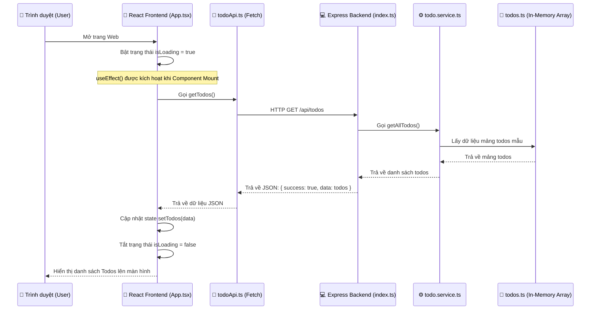

# HƯỚNG DẪN LUỒNG HOẠT ĐỘNG TOÀN DIỆN & CẤU TRÚC DỰ ÁN
## Dự án: Todo App Fullstack (React + Express + TypeScript + Bun)

Tài liệu này mô tả chi tiết cấu trúc thư mục của dự án, ý nghĩa của từng thành phần, và cách dữ liệu di chuyển giữa Frontend và Backend khi ứng dụng vận hành các chức năng CRUD.

---

## 1. CẤU TRÚC THƯ MỤC DỰ ÁN & Ý NGHĨA TỪNG THÀNH PHẦN

Ứng dụng được tổ chức theo mô hình Fullstack tách biệt rõ ràng giữa **Frontend (React)** và **Backend (Express API)**. Sự phân chia này giúp mã nguồn dễ bảo trì, dễ mở rộng và kiểm thử độc lập.

### Sơ đồ cấu trúc tổng quan:

```text
todo-app/
├── backend/                       # MÃ NGUỒN PHÍA SERVER (API SERVER)
│   ├── src/
│   │   ├── controllers/           # Tầng điều hướng (Request/Response Handlers)
│   │   │   └── todo.controller.ts # Tiếp nhận req, gọi service, trả về status/JSON
│   │   ├── data/                  # Cơ sở dữ liệu mẫu (In-Memory Database)
│   │   │   └── todos.ts           # Mảng todos khởi tạo ban đầu phục vụ lưu tạm thời
│   │   ├── middleware/            # Bộ lọc trung gian (Middlewares)
│   │   │   └── errorHandler.ts    # Bắt lỗi tập trung cho toàn ứng dụng
│   │   ├── routes/                # Cấu hình định tuyến (API Routing)
│   │   │   └── todo.routes.ts     # Khớp các HTTP Methods (GET, POST, PUT, DELETE)
│   │   ├── services/              # Tầng nghiệp vụ xử lý chính (Business Logic)
│   │   │   └── todo.service.ts    # Validate dữ liệu, CRUD logic trên data store
│   │   ├── types/                 # Các định nghĩa kiểu dữ liệu (TypeScript Types)
│   │   │   └── todo.type.ts       # Kiểu Todo, CreateTodoRequest, ApiResponse
│   │   └── index.ts               # Điểm khởi chạy (Entry Point) của Express Server
│   ├── tsconfig.json              # Cấu hình TypeScript compiler cho backend
│   └── package.json               # Khai báo thư viện phụ thuộc & lệnh chạy backend
│
├── frontend/                      # MÃ NGUỒN PHÍA CLIENT (REACT APP)
│   ├── src/
│   │   ├── assets/                # Chứa hình ảnh, icons tĩnh
│   │   ├── components/            # Các thành phần giao diện (UI Components)
│   │   │   ├── FilterButtons.tsx  # Cụm nút chuyển đổi lọc trạng thái
│   │   │   ├── TodoForm.tsx       # Form nhập liệu thêm/cập nhật Todo
│   │   │   ├── TodoItem.tsx       # Hiển thị và xử lý cục bộ một dòng Todo
│   │   │   └── TodoList.tsx       # Bao bọc, quản lý danh sách & trạng thái trống
│   │   ├── services/              # Kết nối và trao đổi dữ liệu với Server
│   │   │   └── todoApi.ts         # Gọi fetch API tới Express API
│   │   ├── types/                 # Kiểu TypeScript đồng bộ với Backend
│   │   │   └── todo.type.ts       # Định nghĩa các interfaces phục vụ client-side
│   │   ├── App.tsx                # Component gốc điều phối trạng thái (Central State)
│   │   ├── index.css              # Quản lý Style Sheet, Dark theme & hiệu ứng
│   │   └── main.tsx               # Khởi nguồn chạy React, gắn cây DOM vào HTML
│   ├── index.html                 # Trang HTML vật lý duy nhất của SPA
│   ├── vite.config.ts             # Cấu hình đóng gói & dev server của Vite
│   └── package.json               # Khai báo thư viện phụ thuộc & lệnh chạy frontend
│
├── FLOW_GUIDE.md                  # Hướng dẫn chi tiết luồng hoạt động dữ liệu (File này)
├── INSTRUCTIONS.md                # Tài liệu các bước thiết lập & chạy dự án từ đầu
└── project_analysis_and_learnings.md # Nhật ký phân tích hệ thống & bài học thu được
```

### Ý nghĩa chi tiết của từng thành phần:

> [!NOTE]
> **Kiến trúc Layered Architecture (Backend)**
> Việc chia nhỏ backend thành Controller, Route, Service, và Data giúp đảm bảo nguyên tắc Single Responsibility (mỗi lớp chỉ làm đúng một việc). Lớp Service không quan tâm đến HTTP request/response, trong khi lớp Controller không quan tâm đến logic nghiệp vụ chi tiết.

#### Backend (Server-side)
*   **`src/index.ts`**: Entry point khởi tạo server Express, cấu hình CORS, JSON parser và import router để bắt đầu lắng nghe port `3000`.
*   **`src/routes/todo.routes.ts`**: Định tuyến URL. Bản đồ kết nối HTTP Requests tới Controller thích hợp.
*   **`src/controllers/todo.controller.ts`**: Trực tiếp nhận request (`req`), rút trích dữ liệu từ body/query/params, gọi service xử lý, và trả về dữ liệu chuẩn kèm HTTP status code cho client qua response (`res`).
*   **`src/services/todo.service.ts`**: Nơi chứa toàn bộ nghiệp vụ (Business Logic). Bao gồm validate đầu vào, sinh tự động UUID/Id, định dạng ngày tháng, và tương tác trực tiếp với dữ liệu thô.
*   **`src/data/todos.ts`**: Database giả lập (in-memory). Chứa mảng các đối tượng todo mẫu, được tải trực tiếp lên RAM khi ứng dụng backend chạy.
*   **`src/middleware/errorHandler.ts`**: Bộ lọc lỗi tập trung. Tự động gom tất cả exception xảy ra trên backend và phản hồi về client dưới cấu trúc thống nhất.

#### Frontend (Client-side)
*   **`src/main.tsx`**: File chạy chính ở client, liên kết React component root (`App`) vào cây DOM HTML.
*   **`src/App.tsx`**: Trái tim điều phối của Frontend. Nơi quản lý State trung tâm (danh sách todos, bộ lọc, trạng thái loading, lỗi). Truyền các handlers và state xuống các components con qua props.
*   **`src/components/`**: Các thành phần UI có thể tái sử dụng:
    *   `TodoForm.tsx`: Xử lý thêm mới/sửa công việc kèm validation phía client.
    *   `TodoItem.tsx`: Dòng hiển thị công việc cụ thể, hỗ trợ edit inline, checkbox toggle, và nút delete.
    *   `TodoList.tsx`: Nhận mảng đã lọc và hiển thị danh sách các `TodoItem`, quản lý trạng thái loading và empty screen.
    *   `FilterButtons.tsx`: Bộ điều khiển lọc theo trạng thái (Tất cả, Đang làm, Đã xong).
*   **`src/services/todoApi.ts`**: Gọi fetch API tới server. Đóng gói các hàm gọi HTTP request giúp các component frontend không bị lẫn lộn giữa code giao diện và logic gọi mạng.
*   **`src/index.css`**: CSS tùy chỉnh chứa các variables màu sắc hiện đại, glassmorphism, và animations mượt mà.

---

## 2. LUỒNG KHỞI CHẠY ỨNG DỤNG (INITIALIZATION FLOW)

Khi người dùng mở ứng dụng trên trình duyệt (`http://localhost:5173`):



---

## 3. LUỒNG THÊM MỚI TODO (ADD TODO FLOW)

Khi người dùng nhập tiêu đề công việc, chọn độ ưu tiên và nhấn nút **"Thêm"**:

```mermaid
sequenceDiagram
    participant User as 👤 Trình duyệt (User)
    participant Form as ✍️ TodoForm.tsx
    participant App as 🎨 App.tsx (Root State)
    participant API as 📡 todoApi.ts (Fetch)
    participant Router as 🔀 Router (todo.routes.ts)
    participant Controller as 🎮 Controller (todo.controller.ts)
    participant Service as ⚙️ Service (todo.service.ts)
    participant DB as 📁 Data (todos.ts)

    User->>Form: Nhập Title & Chọn Priority -> Submit
    Form->>Form: Kiểm tra Title rỗng? (Validate client)
    Form->>App: Kích hoạt callback handleAddTodo(title, priority)
    App->>API: Gọi createTodo({ title, priority })
    API->>Router: HTTP POST /api/todos với body JSON
    Router->>Controller: Chuyển tiếp tới hàm createTodo(req, res)
    Controller->>Service: Gọi createTodo({ title, priority })
    
    rect rgb(30, 30, 50)
        Note over Service: THỰC HIỆN BIẾN ĐỔI & VALIDATE
        Service->>Service: Validate title không rỗng
        Service->>Service: Validate priority thuộc ['low', 'medium', 'high']
        Service->>Service: Tạo id mới (nextId++), lấy createdAt = ISO String
    end

    Service->>DB: Push todo mới vào mảng dữ liệu
    DB-->>Service: Lưu thành công
    Service-->>Controller: Trả về đối tượng Todo hoàn chỉnh
    Controller-->>API: Phản hồi HTTP 201 Created + JSON ApiResponse
    API-->>App: Trả về Todo mới
    App->>App: Cập nhật state setTodos([newTodo, ...prevTodos])
    App-->>User: React tự động render lại UI, Todo mới xuất hiện đầu danh sách
```



---

## 4. LUỒNG ĐÁNH DẤU HOÀN THÀNH (TOGGLE COMPLETED FLOW)

Khi người dùng click vào checkbox của một Todo:

1.  **Sự kiện Click**: Checkbox trong `TodoItem.tsx` kích hoạt sự kiện `onChange`.
2.  **Kích hoạt Callback**: Gọi hàm `onToggle(id)` truyền ngược lên `App.tsx`.
3.  **Gọi API**: `App.tsx` gọi hàm `todoApi.toggleTodo(id)` thực hiện request `PUT /api/todos/:id/toggle`.
4.  **Backend xử lý**:
    *   Router nhận request và khớp ID từ route params.
    *   Controller gọi `todoService.toggleTodo(id)`.
    *   Service tìm Todo có ID tương ứng trong mảng.
    *   Đảo ngược giá trị `completed` (nếu là `true` thành `false` và ngược lại).
    *   Trả về đối tượng Todo sau khi thay đổi.
5.  **Cập nhật State ở Client**:
    *   Frontend nhận về Todo đã cập nhật từ server.
    *   Cập nhật state `todos` bằng cách map qua mảng cũ:
        ```typescript
        setTodos(prev => prev.map(todo => todo.id === id ? updatedTodo : todo))
        ```
    *   React cập nhật giao diện: chữ bị gạch ngang (strikethrough) và giảm độ mờ (opacity) nếu hoàn thành.

---

## 5. LUỒNG XÓA TODO (DELETE TODO FLOW)

Khi người dùng click nút Thùng rác:

1.  **Xác nhận (Confirmation)**: Trình duyệt hiển thị hộp thoại `window.confirm("Bạn có chắc chắn muốn xóa...")`.
2.  **Gọi API**: Nếu người dùng chọn **OK**, hàm `onDelete(id)` được gọi để gửi request `DELETE /api/todos/:id` lên Server.
3.  **Backend xử lý**:
    *   Service tìm index của phần tử trong mảng bằng `findIndex(todo => todo.id === id)`.
    *   Sử dụng hàm `.splice(index, 1)` để loại bỏ phần tử ra khỏi mảng dữ liệu in-memory.
    *   Trả về thông tin của Todo đã bị xóa.
4.  **Cập nhật State ở Client**:
    *   Sau khi API trả về kết quả thành công, frontend loại bỏ phần tử này khỏi state:
        ```typescript
        setTodos(prev => prev.filter(todo => todo.id !== id))
        ```
    *   React cập nhật giao diện, Todo biến mất kèm hiệu ứng chuyển động mượt mà.

---

## 6. LUỒNG LỌC DỮ LIỆU CÔNG VIỆC (CLIENT-SIDE FILTER FLOW)

> [!TIP]
> **Tại sao lại lọc ở Client-side?**
> 1. **Tốc độ tức thì**: Lọc trực tiếp trên mảng `todos` đã lưu sẵn trong RAM của trình duyệt. Không có độ trễ mạng (Network latency).
> 2. **Giảm tải cho Server**: Tránh việc liên tục gửi HTTP request lên backend chỉ để lấy lại một tập con của dữ liệu đã có sẵn.
> 3. **Code gọn gàng**: Sử dụng array method `.filter()` của Javascript rất nhanh và tiện lợi.

```mermaid
graph TD
    User([👤 Người dùng]) -->|Click Button Lọc| FB[FilterButtons.tsx]
    FB -->|onFilterChange| App[App.tsx]
    App -->|Thay đổi state filter: all/active/completed| Render[Tính toán filteredTodos]
    Render -->|todos.filter(...) Client-side| TL[TodoList.tsx]
    TL -->|Hiển thị danh sách đã lọc| User
```

---

## 7. LUỒNG XỬ LÝ LỖI (ERROR FLOW)

Nếu Server bị mất kết nối (down) hoặc dữ liệu gửi lên không hợp lệ:

1.  **Lỗi xảy ra**: Hàm `fetch` trong `todoApi.ts` nhận HTTP Status `>= 400` hoặc gặp lỗi kết nối (Network Error) -> Ném ra một `Error` đối tượng.
2.  **Bắt lỗi (Catch)**: Khối lệnh `try/catch` trong các hàm xử lý ở `App.tsx` hoặc `TodoForm.tsx` sẽ bắt lấy lỗi này.
3.  **Cập nhật UI**:
    *   Set trạng thái `error`: `setError(error.message)`.
    *   React hiển thị Error Banner màu đỏ ở trên cùng giao diện cùng hiệu ứng rung lắc (shake) để gây chú ý cho người dùng.
4.  **Khôi phục**: Người dùng có thể nhấn nút **✕** trên banner lỗi để đóng thông báo (set `setError("")`), đưa ứng dụng về trạng thái bình thường.
